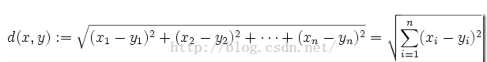
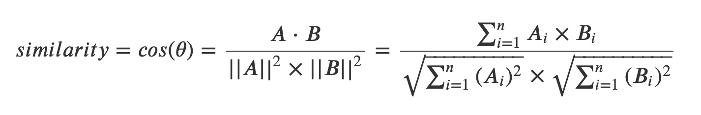
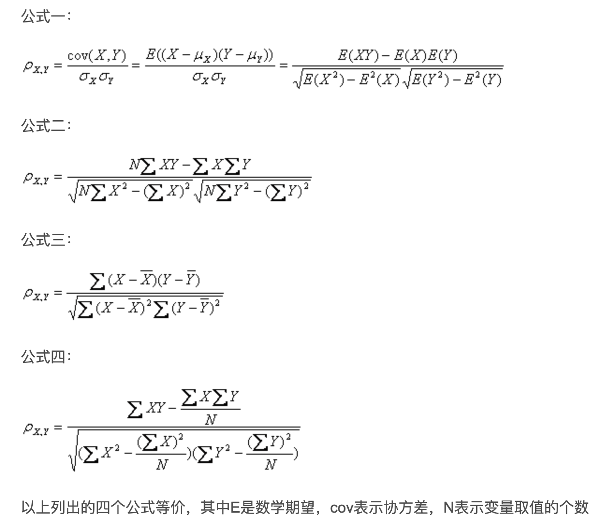
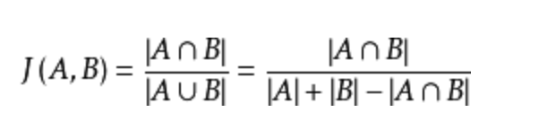
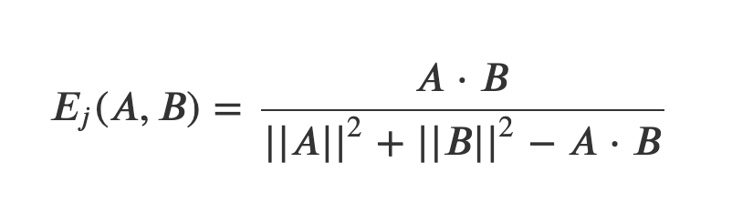

# Chapter2:提供推荐

## 协作型过滤

## 搜集偏好

## 寻找相近的用户

### 欧几里得距离评价

* 公式：

* 说明:
欧式距离是一种比较容易理解的距离计算方式，源自欧式空间中亮点间的距离公式得到。

### 余弦相似度(cosine similarity)

* 公式:
* 说明:
借用了代数意义上的夹角余弦的概念，来衡量样本向量间的差异。

### 皮尔逊相关度系数

* 公式:

* 说明:
皮尔逊相关度评价的值的取值范围为r=[-1,1],r=-1表示完全负相关,r=0代表完全不想关，r=1代表对电影的评价完全相同。这就说明r的绝对值越大，相关性越强，绝对值越小相关度越小。
另一个优点是:修正了"夸大分值"的情况

### Jaccard相似系数

* 公式:

* jaccard系数：J(A,B)=|A∩B|/|A∪B|
* jaccard距离：1-J(A,B)=(|A∪B|-|A∩B|)/|A∪B|
* jaccard距离是与jaccard系数相反的概念。jaccard系数越大，二者越相似；而jaccard距离越大，二者越不相似。

* 说明：
jaccard算法并不适用于具有用户评分的电影推荐的场景。因为此算法忽略了评分，而只是对于用户对某些电影有没有评价进行评价，评价电影的交集个数处以并集个数。非常不精确。

### Tanimoto系数

* 公式:

### 曼哈顿距离算法
* 公式: C = |x1-x2|+｜y1-y2｜

